# Siege Week 2 -> Name TBD
The game I'm making for Hackclub's Siege; The theme this week was Magic!

A puzzle platforming game where you're a magician!

Instead of doing framework progress reports like last time, we're doing devlogs!

Here's a [demo video](assets/screenshots/demo.mp4), linked incase the html breaks TvT;

<video src="assets/screenshots/demo.mp4" width="90%" controls></video>

## Devlogs (Mon. 10-6-25 to Sun. 10-12-25)
### Monday -> Planning
- I spent this entire day planning out what I want to do in a Notion document. Not much else to say, honestly. 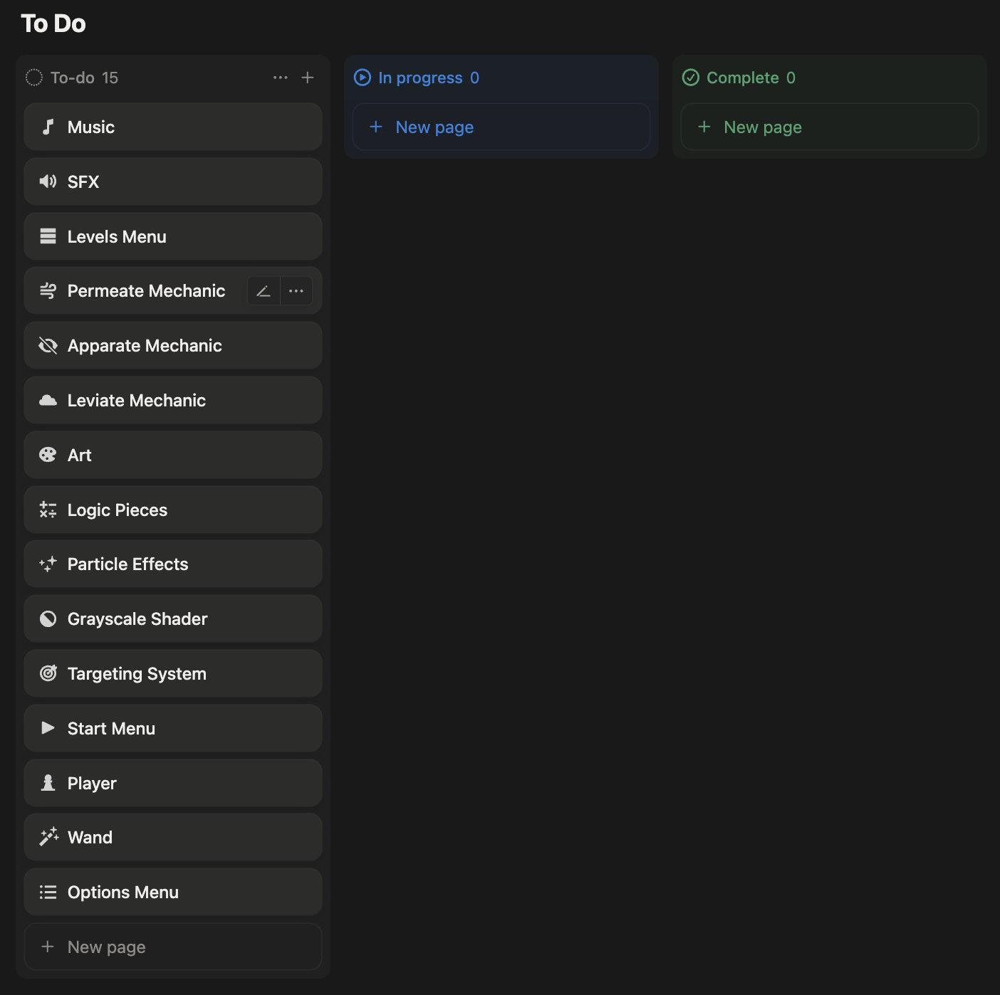
### Tuesday -> Setup, Targeting & Menus
- I imported all the scripts for functionality from my last project (I'm slowly building a modular system)
- Deleted assets, anything specific to that game, and changed the project name so the time tracking will work right.
- I got the platforming controller set up, and made a basic targetting system that moves a certain disance towards the mouse from the player, see below.
- 
- Small square -> Target, Small line -> Mouse
- Additionally, I got the entire UI pretty much up and working (wow this framework is nice), we've got a start menu, volume control, and a level select screen! It definitely will need some tweaks (like art ofc) later, but it's functional at least.
- 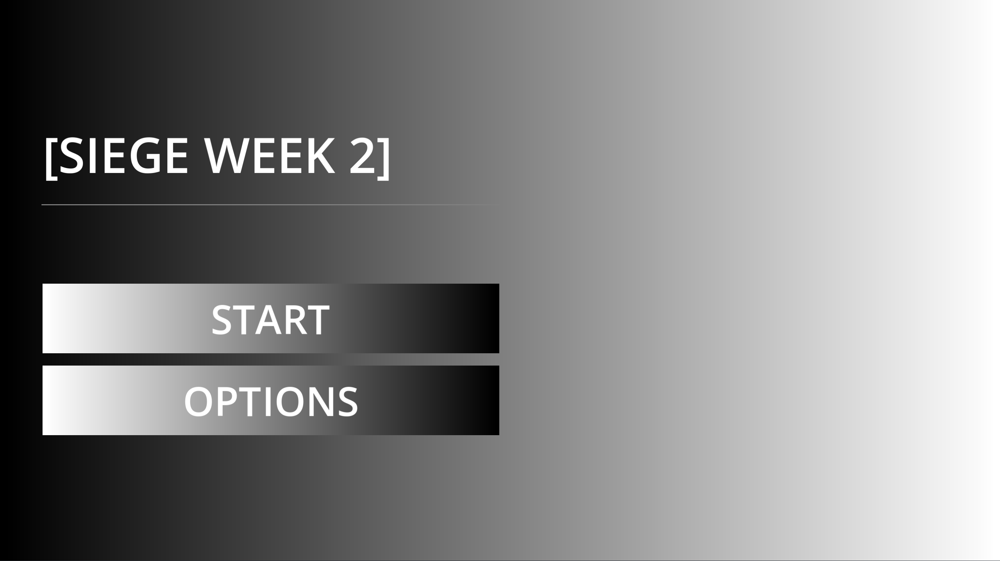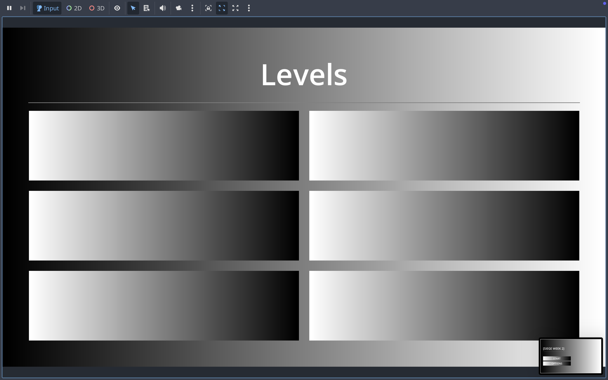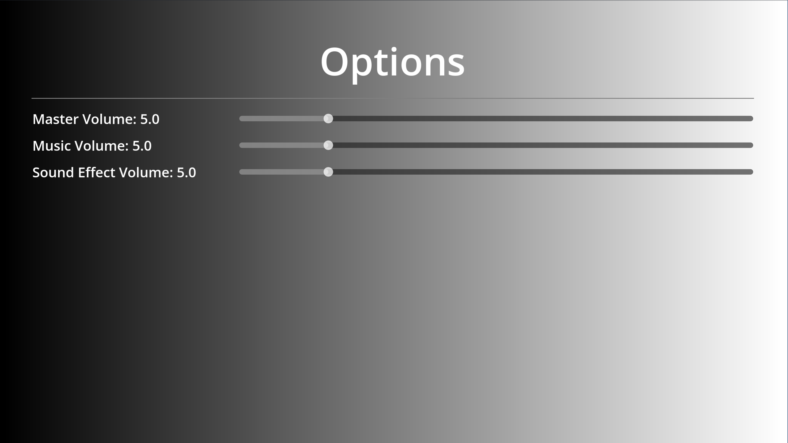
- That was all for Tuesday, and it's a pretty good start if I do say so myself. Mostly the easy stuff. Here's how the list is looking now; 
- 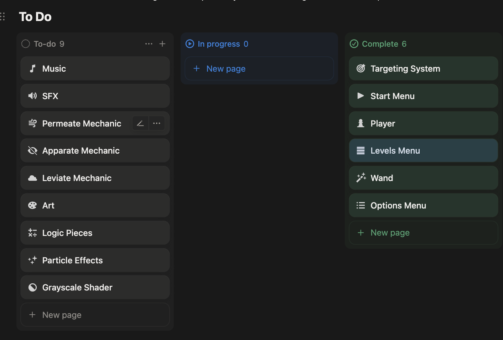
### Wednesday -> Main Mechanic Grind
- My goal for today was to get the main puzzle mechanics, of which there are 3, all working.
- I ended up getting two done, and getting stuck on the third...
- Anyways, we've got working Permeate and Apparate, two of the three puzzle mechanics
    - Permeate's effectively a collisionless dash, that you have a certain amount of per level
    - Apparate lets you use your wand to make things disappear, and then reappear in a new place (I'm very proud of the code to stop you from putting things in walls)
- These are both things that would need videos to show well, so have a flowchart of the third mechanic instead, plus ofc the updated ToDo list.
- 
- 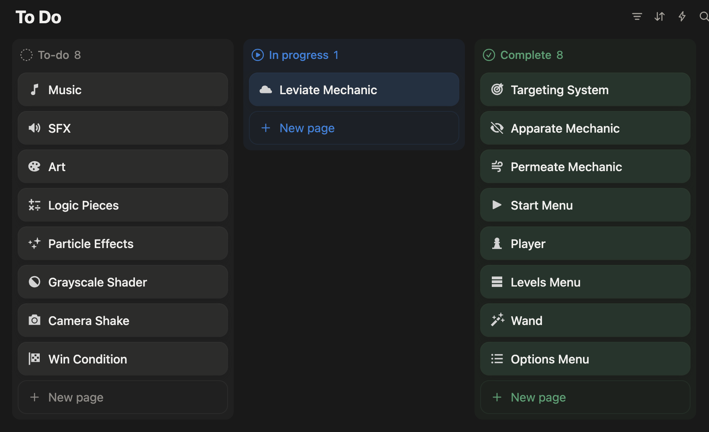
### Thursday -> Final Mechanics & MVP
- I finally finished the last mechanic (the bug was really simple, of course).
    - Leviate -> Lets you make objects float, of which you can only have a certain amount floating per level.
- Additionally, I've got the grayscale shader I wanted to make done, and set up the basic bits of it!
- 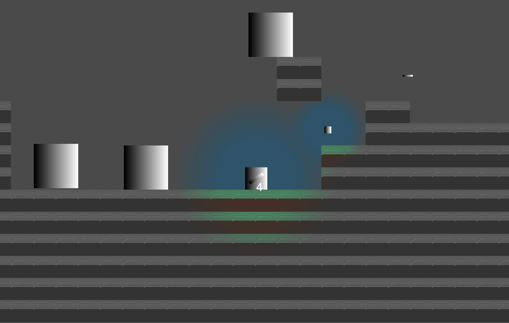
- In other news, I finished up the following, making the game fully playable (still no levels D:)
    - You can complete a level by reaching the goal (which doesn't have art or in-game meaning yet...)
    - You can reset levels with R.
- --
- Since then, I've started working on the art, since I want this to be *polished*.
- 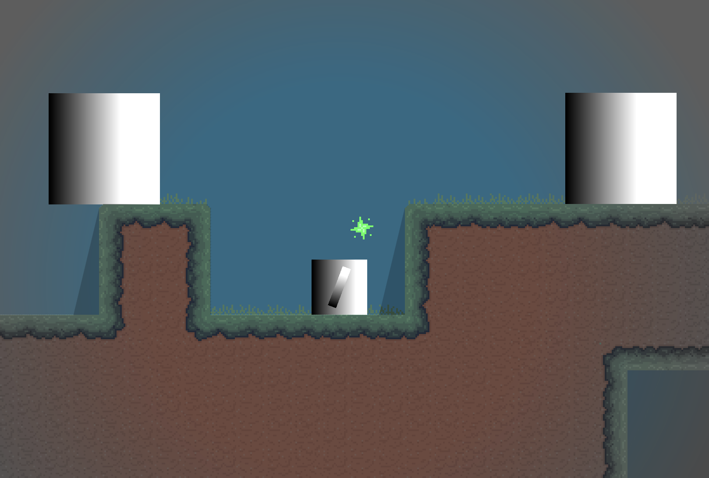
- I also zoomed in the camera quite a bit, since it was kind of far out before. It might still change a bit. Anyways, here's how the ToDo list's looking!
- 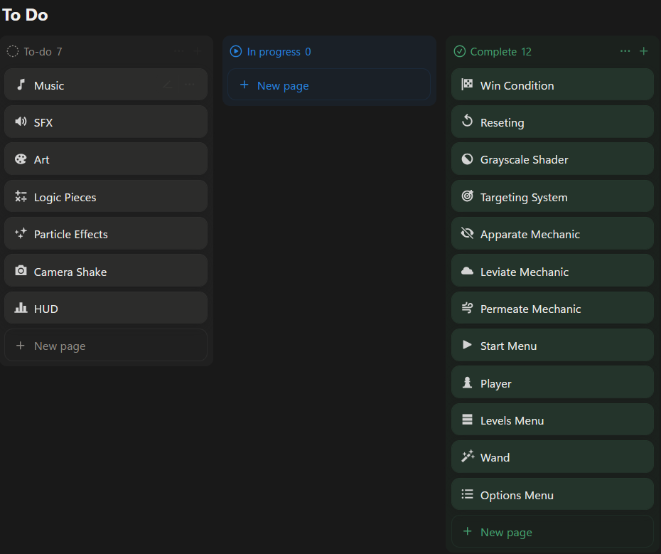
### Friday -> Polish & Levels
- I spent a LONG time working today, so I forgot to take more in-progress screenshots, but all of the art for the game is done!
- 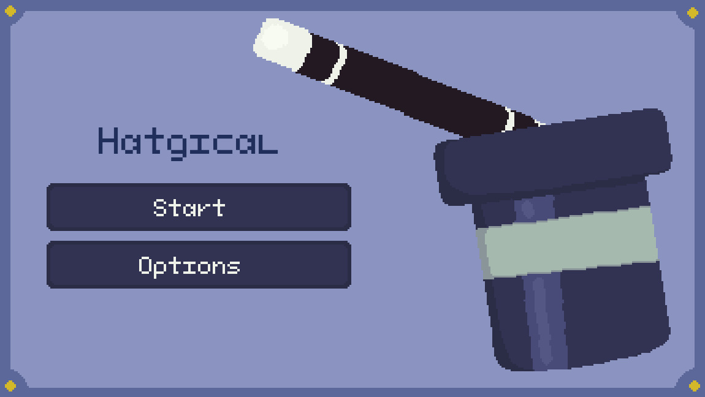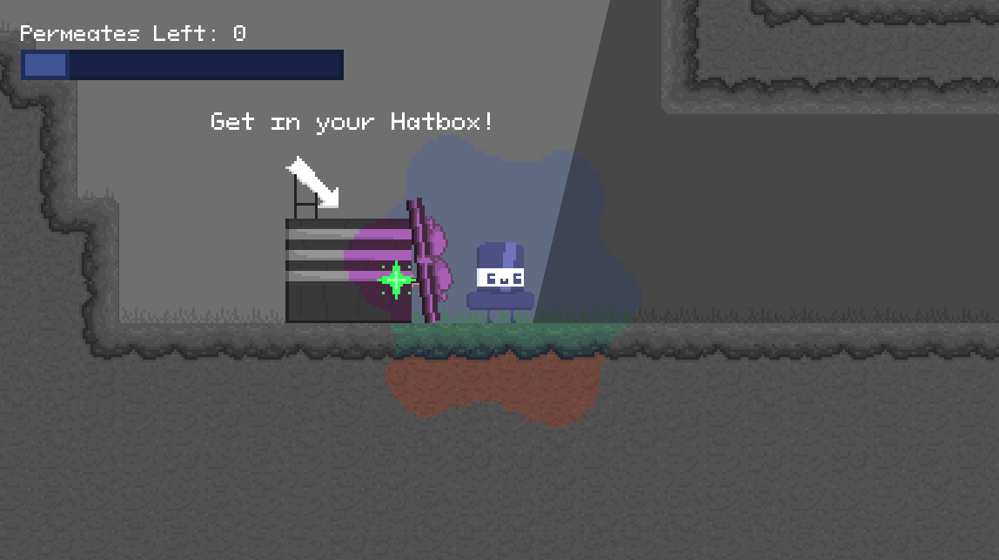
- I also added music - I didn't have time to make any of my own so I used [Curious Critters by Matthew Pablo](https://opengameart.org/content/curious-critters), from OpenGameArt.com
- In other news, there are now in-game HUDs;
    - for seeing how many times you can Permeate left -> see the above picture, with a cooldown bar.
    - for seeing how many objects you can Leviate at once. 
- My plan for tomorrow, which will likely be my final day working on this, is to get more levels, as there are 4 right now and I haven't even introduced all the mechanics yet.
- Now here's how the ToDo list's looking! I cut out everything but what I've planned.
- 
### Saturday -> Submission!
- Not much to say, I fixed up some bugs, and got 4 more levels made.
- Also changed how the player and walls interact, to allow for a cool (and hopefully intuitive) interaction in the final level.
- Here's the final ToDo list,just for fun;
-  
- Overall, this was very fun, and definitely my best Siege week game (and one of my best games period).
    - I especially enjoying going down the technical art rabbit hole for the grayscale effect.
    - The framework I've been building for this is finally well-done enough that the actual construction went by pretty fast, allowing me to focus on polishing, and I think it shows!
